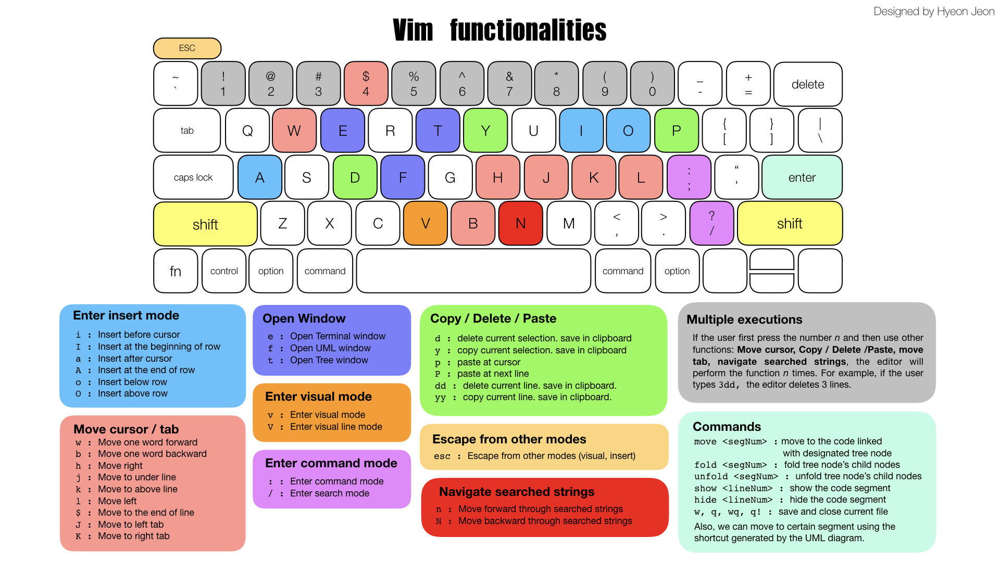

# SimVim

Convienient, light, simple vim. 

Implemented by the undergraduated students from POSTECH, HIT, UTT, as the group project of POSTECH CSED332 Software Design Method (2019 Fall) class.

### Contributor

[Seungmok Han](hsm9300@postech.ac.kr) 
[Jaejin Kim](starjm0807@postech.ac.kr)
[Qiaoqian Du](qiaoqian@postech.ac.kr)
[Shuzhe Cai](caishuzhe97@postech.ac.kr)
[Hyeon Jeon](jeonhyun97@postech.ac.kr)
[Yoonsu Kim](yoonsu0816@postech.ac.kr)
[MoonKyung Song](moonsong98@postech.ac.kr)
[Taekang Eom](tkeom0114@postech.ac.kr)

### Overview

#### Motivation

Our project is to implement a convenient, modernized vim plugin for the IntelliJ idea. Even though there already exists a Vim plugin in IDEA, it has some drawbacks. Notably, the plugin does not fit well with the basic facilities provided by IDEA. Therefore, we decided to implement the Vim plugin, which can improve productivity and can be well integrated with the functionalities of IDEA. 

We especially motivated from the Google Chrome plugin `vimium`, which provides vim shortcuts while exploring window. However, the plugin has more simple, but more powerful and convenient shortcuts, comparing to the original vim shortcuts. One of our goal, "convenient" is especially influenced by this factor.

#### Why not ideaVim?

Actually, It is easy to notice that **ideaVim**, the plugin that helps developers to use vim shortcuts in Intellij IDEA, is the most downloaded plugins in the IDEA plugin market. However, this has problems: not only the poor integration with the IDEA but also from the perspective of developing / refactoring. 

The first release of ideaVim was before 2012, only three years after the release of IntelliJ IDEA community ver. Therefore, the code used several tricks to implement vim functionalities due to the lack of libraries for plugin Development. For example, ideaVim code designed the shape of the cursor to use block cursor. In our plugin, we can easily use the pre-designed block cursor using the predefined function `editor.getSettings().getBlockCursor()`. Due to these poor early designs, now the code size of the ideaVim became too large, and it also has huge complexity. Therefore, it became reasonable to reimplement vim functionalities using upgraded support of the IDEA plugin development toolkit. We tried to make the code as simple as we can and made the common interface to add a new function, using these new libraries. 

Also, as the "original vim" had developed for a long time since it's the first release, some functions became too hard to access. This problem occurs primarily in "navigation". It is somewhat complicated to navigate in vim. For example, we have to type the word "tab" in the command mode to move to a specific tab or file. Also, there is no way to see the overall structure of the project in vim. Therefore, we decided to reinforce the features of navigation and achieved it by developing **SimVim**.

### Functionalities

#### Layout

#### Summary

- Basic vim functionalities
  - Save / close file
  - Tab control
  - Cursor movement
  - Delete / Copy / Paste
  - Search / iterate thorugh found strings
  - Multiple execution
- Insert mode
- Commnad mode
- Visual mode
  - Basic visual mode
  - Visual linde mode
- Open / Close code segment
- Project tree structure
  - Show the tree structure of the project 
  - Expand / minimize certain node of the tree
  - Assign identifier to each node
  - move / open to the code corressponding to certain node
- UML diagram
  - Show the diagram of the project structure
  - Generate shortcut to each classes
  - Navigate using the shortcut
- Integrating terminal
  - Access terminal window

Reference our [user scenario](https://csed332.postech.ac.kr/team7/team7_project/wikis/explanations/user_scenario) for the specific functionalities.

